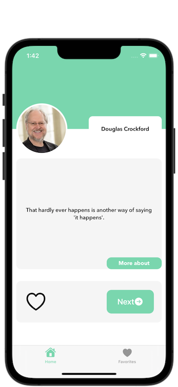
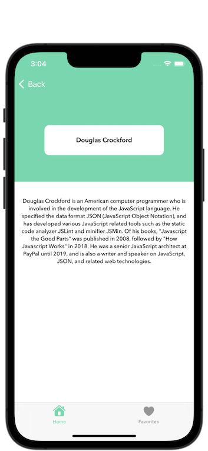
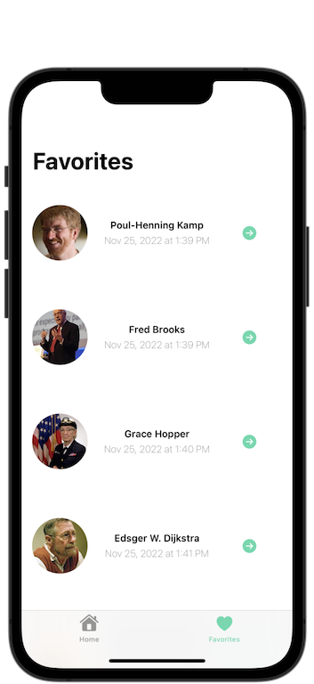
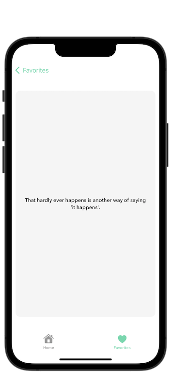
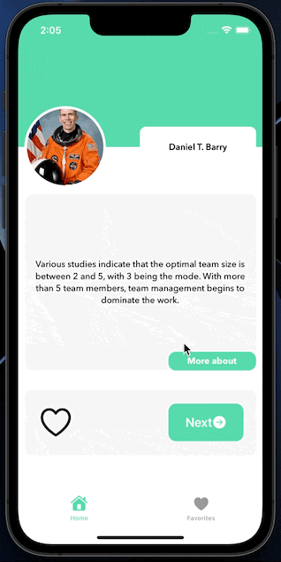

# Programmer Quotes
ProgrammerQuotes is a mobile app that contains programming-related quotes. You can save your favorite quotes to your favorites and learn more about the person who said the quote.

## Description

- UIKit
- Programmatic UI (No Storyboard).
- MVVM Design Pattern
- [Wiki API](https://test.wikipedia.org/w/api.php) to fetch image url and description who said the quote.
- [Programming Quotes API](https://github.com/skolakoda/programming-quotes-api) to fetch quote and who said the quote.
- [Realm](https://realm.io/) was used to save favorite quote.
- [Kingfisher](https://github.com/onevcat/Kingfisher) was used to show who said the quote.
- I followed the [trendyol code's style guidelines](https://github.com/aniltaskiran/ios-guidelines/blob/master/code_style_guideline/code_style_guideline.md).

## Requirements

- Make sure you have an internet connection.

## Support Me 

Please contact me if you find any bad code, I am eager to learn more. 

## Screenshots

## License

**ProgrammerQuotes** is available under the MIT license. See the LICENSE file for more info.

## Authors

- [@tahabozdemir](https://www.github.com/tahabozdemir)

## Support

For support, email taha@bozdemir.net

